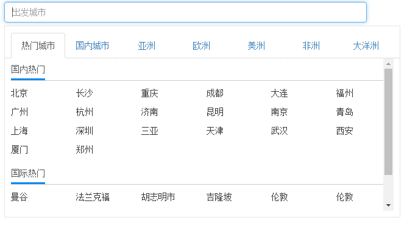

## MOCK安装与启动 （进入到_mock文件下）

    npm install

> 请务必安装 nodemon 启动项目提高调试效率 `npm install nodemon -g`


```shell
nodemon -w fms.js fms.js
```
或者

```shell
node fms.js
```
ps：修改后，需要自己手动重启

## 项目启动

> 先启动MOCK再启动项目

- npm install 
- bower install
- gulp serve


## 自定义指令
### 1.城市选择控件
该城市控件支持选择、搜索城市，目前搜索城市的结果是返回固定数组



